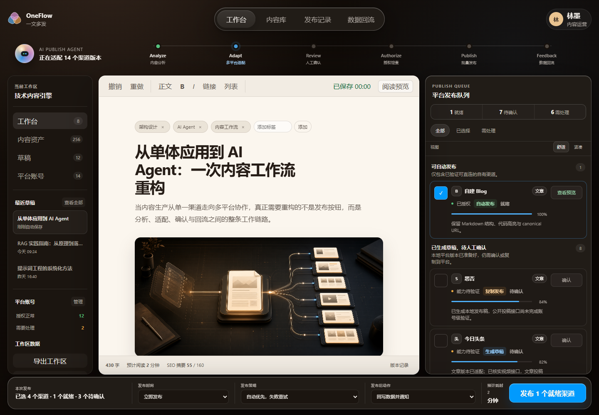

# OneFlow 一文多发

OneFlow 是面向 AI 内容创作者的“一文多发发布中枢”。它将文章编辑、AI
分析、多平台适配、人工确认、授权检查、批量发布和数据回流组织在同一工作台中。

当前阶段为 **Phase 6.1，Halo Publisher 可靠性加固**。Vanilla JS 工作台保持不变，后端已
打通 Halo 2.x PAT、Console API 草稿创建、可选发布、远程结果回写与失败重试。PAT
只在服务端加密保存，仓库不包含真实平台 Token、账号凭证或支付密钥。



## 核心能力

- 克制的 Apple Liquid Glass 风格高保真 UI。
- 高可读性的本地文章编辑器，支持标题、摘要、正文、标签和封面说明。
- 14 个内容平台的版本状态、授权、适配进度和发布方式管理。
- 基于 `localStorage` 的本地持久化和 v1/v2 → v3 数据迁移。
- 发布批次、文章和渠道版本的不可变快照。
- 基础 HTML sanitizer，过滤危险标签、事件属性和 `javascript:` 链接。
- 工作区 JSON 导入、导出、损坏数据备份和演示数据重置。
- 发布记录与批次任务详情。
- 当前草稿与已发布快照组成的内容库。
- 登录入口明确区分本地开发模式与尚未接入的 SaaS 云端模式。
- 创作者任务中心、渠道设置、图床、AI 能力、Billing、团队和设置页面。
- `Free`、`Pro`、`Studio / Team` 套餐与可测试 Entitlement 判断。
- 11 个可刷新恢复的 Hash 路由。
- 桌面端优先、兼容平板的响应式布局。
- Reduced Motion、Reduced Transparency 和高对比度降级。
- 可选 SaaS Dev Mode，通过 API 同步文章、渠道、用量与发布批次。
- Workspace 隔离的 Fastify API 与 Prisma 数据模型。
- 服务端 Entitlement 校验和不回传凭据的 ChannelConfig。
- 后端 Mock Worker 成功、失败、结果回写与重试链路。
- 密码注册/登录、持久 Session、退出登录与刷新恢复登录态。
- Owner/Admin/Editor/Viewer 服务端 RBAC。
- Workspace.plan 驱动的服务端 Entitlement。
- SQLite 本地 schema 与 PostgreSQL 兼容 schema 双校验。
- 自建 Blog / Halo 服务端真实草稿发布链路。
- Halo PAT 加密保存、连接测试、凭据清除和 owner/admin RBAC。
- Publisher Router 在 Halo Worker 与 Mock Worker 之间选择执行器。
- Halo URL SSRF 防护、15 秒可配置超时与本地私网开发开关。
- 发布任务稳定幂等键、过期可回收任务锁、slug 冲突恢复和安全事件时间线。

## 产品工作流

```text
写文章
  → Analyze 内容分析
  → Adapt 多平台适配
  → Review 人工确认
  → Authorize 授权检查
  → Publish 批量发布
  → Feedback 数据回流
```

平台能力采用保守建模：

- 自建 Blog 作为自动发布示例。
- 第三方文章平台以生成草稿、复制发布和人工确认流程为主。
- 抖音、小红书、哔哩哔哩进入标题、封面、脚本、话题和简介等内容再加工流程。
- 未验证的平台能力明确标记为“待验证”或“半自动”。

## 技术栈

- HTML
- CSS
- Vanilla JavaScript
- `localStorage`
- `sessionStorage`
- Node.js built-in test runner
- Fastify
- Prisma
- SQLite
- PostgreSQL-compatible Prisma schema
- Argon2id
- AES-256-GCM 本地凭据加密

前端不依赖框架或外部付费素材。Local Demo Mode 不依赖后端；SaaS Dev Mode 使用
本地 API、数据库和 Mock Worker。生产目标仍需 PostgreSQL、Durable Queue、对象
存储、AI Provider Gateway 与 Billing Provider。

## 本地运行

### 统一启动

需要 Node.js 22.11 或更高版本：

```powershell
git clone https://github.com/hengxiaopai/oneflow-publish-hub.git
cd oneflow-publish-hub
Copy-Item server/.env.example server/.env
npm --prefix server install
npm run db:generate
npm run db:migrate
npm run db:seed
npm run dev
```

前端运行于 `http://127.0.0.1:4173`，API 运行于
`http://127.0.0.1:4174`。也可分别执行：

```powershell
npm run dev:frontend
npm run dev:server
```

浏览器访问 `http://127.0.0.1:4173/#/login`：

- **Local Demo Mode**：使用 `localStorage`，后端未启动也可用。
- **SaaS Dev Mode**：调用本地 API、SQLite 与后端 Mock Worker。
- **SaaS Auth Mode**：真实注册/登录，Session 仅通过 httpOnly Cookie 管理。

进入 `#/channels` 可配置自建 Blog / Halo。默认发布模式是“创建草稿”；只有用户显式
选择“创建并发布”时，Worker 才会在创建草稿后调用 publish endpoint。

没有可用 Halo 实例时，可在另一个终端运行 `npm run dev:fake-halo`，使用
`http://127.0.0.1:4180` 复现连接测试、创建草稿与结果回写。该测试桩不保存 PAT，
也不用于生产环境。

真实 Halo 人工验收：

```powershell
$env:HALO_TEST_BASE_URL="https://blog.example.com"
$env:HALO_TEST_ENDPOINT="/apis/api.console.halo.run/v1alpha1"
$env:HALO_TEST_PAT="<local-secret>"
$env:HALO_TEST_MODE="draft"
npm run test:halo-smoke
```

命令只创建带时间戳的私有测试草稿，缺少变量时自动跳过，不输出 PAT。详见
[Halo Smoke Test](docs/halo-smoke-test.md)。

需要 Seed 一个可登录的本地演示账号时，只在 `server/.env` 配置：

```text
DEMO_USER_EMAIL=creator@example.test
DEMO_USER_NAME=OneFlow Creator
DEMO_USER_PASSWORD=replace-with-a-local-password
```

然后执行 `npm run db:seed`。仓库不会硬编码或提交演示密码。

后端未启动或请求超时时，顶部状态会显示 API 不可用，登录页给出“可切换到本地开发
模式”的明确提示，不影响 Local Demo Mode。

完整说明见 [Backend Setup](docs/backend-setup.md) 和
[Development Workflow](docs/development-workflow.md)。生产数据库切换见
[PostgreSQL Migration](docs/postgres-migration.md)。

### Docker 后端

```powershell
Copy-Item .env.example .env
docker compose up --build
npm run dev:frontend
```

Docker Compose 只启动后端，SQLite 存放在 named volume。示例密钥仅供本地开发，
生产部署必须替换。详见 [Deployment Notes](docs/deployment-notes.md)。

主要路由：

```text
#/dashboard
#/articles
#/workbench
#/publish-history
#/channels
#/media
#/ai-capabilities
#/billing
#/team
#/settings
```

## 测试

提交前统一执行：

```powershell
npm test
npm run check
npm run security:scan
```

可单独执行 `npm run test:frontend`、`npm run test:server`。API 文档位于
`http://127.0.0.1:4174/api/openapi.json`。

如果本机安装了 Codex Skill Creator，可额外验证 Liquid Glass Skill：

```powershell
python "$env:CODEX_HOME\skills\.system\skill-creator\scripts\quick_validate.py" skills\liquid-glass-product-ui
```

## 数据与安全

- Local Demo 工作区数据保存在当前浏览器的 `localStorage` 中。
- SaaS Dev 数据保存在本地 SQLite，并由 `workspaceId` 隔离。
- Phase 6 的真实账号与 Dev Session 均持久化在数据库；Dev Session 仅开发环境可用。
- 密码使用 Argon2id；Session 原始 token 不落库，数据库只保存 hash。
- Cookie 使用 `HttpOnly`、`SameSite=Lax`，生产环境启用 `Secure`。
- 本地开发模式标记仅保存在 `sessionStorage`，不代表真实登录 Session。
- 当前 schema key 为 `oneflow.workspace.v3`，兼容迁移 v1 和 v2。
- 正文会在编辑、恢复、导入和生成发布快照时执行白名单过滤。
- 导入工作区前会显示覆盖确认，不会静默替换本地数据。
- 数据损坏时保留原始内容，允许导出备份或显式重置。
- 仓库不包含真实第三方平台 API Token、Cookie、密码或用户数据。
- 不应将生产密钥写入前端代码、localStorage 或导出的工作区 JSON。
- 正式 SaaS 中平台 Token 必须由后端加密保存，发布任务必须由 Worker 执行。
- Phase 4 ChannelConfig 使用 AES-256-GCM 保存本地密文，API 永不返回凭据原文或密文。
- Phase 4.1 服务启动会校验关键环境变量，生产 CORS 禁止通配符。
- API 日志包含 requestId，并对 Token、Cookie、credential 与 secret 字段脱敏。
- 浏览器直连 Halo 只允许作为本地开发实验，不是 SaaS 正式发布链路。
- Halo PAT 仅在服务端 Worker 请求前短时解密，API 不返回明文或密文。
- Halo Base URL 默认禁止本机、私网、云元数据和非 HTTP(S) 地址；生产仅允许 HTTPS。

安全与存储说明：

- [HTML Sanitization](docs/html-sanitization.md)
- [Storage Migration](docs/storage-migration.md)
- [Local Persistence](docs/local-persistence.md)
- [Public Release Checklist](docs/public-release-checklist.md)
- [SaaS Security Model](docs/security-model.md)
- [Server Token Security](docs/server-token-security.md)
- [Platform Token Handling](docs/security-token-handling.md)
- [API Error Format](docs/api-error-format.md)
- [OpenAPI](docs/openapi.md)
- [Deployment Notes](docs/deployment-notes.md)

## 当前限制

- SQLite 和进程内 Mock/Halo Worker 只适合单机开发。
- `nextRetryAt` 已可计算和展示，但尚无常驻调度器自动消费到期任务。
- Billing、对象存储、独立队列、实时事件和其他第三方平台 API 尚未接入。
- 目前只有 Halo 支持真实发布；其他平台结果仍为 Mock 或半自动建模。
- 第三方平台能力会变化，矩阵中的“待验证”不代表官方承诺。
- `localStorage` 容量有限，不适合图片、视频或大规模版本历史。
- 多标签页同时编辑采用最后写入覆盖，尚无冲突合并。
- sanitizer 是本地 MVP 的最小防线，接入后端后仍需服务端再次过滤。
- 当前没有邮箱验证、密码重置、MFA、OAuth、Durable Queue 或数据分析后端。
- 生产 PostgreSQL migration 已有兼容 schema，但仍需在目标环境生成并演练。

## Halo 方案边界

提交 `c89aa06` 的 Halo 浏览器直连设计是 Phase 3 的本地验证产物。产品转向公开
SaaS 后，该设计已被服务端发布器方案取代：

- MockPublisher 继续服务本地开发和测试。
- HaloPublisher 在正式环境中由后端 Worker 执行。
- Halo PAT 不返回浏览器，不进入导出、日志、截图或测试快照。
- 正式发布链路不依赖 Halo 的浏览器 CORS。

详见 [Halo Integration Boundary](docs/halo-integration.md) 和
[Server-Side Publisher Design](docs/server-side-publisher-design.md)。

## Roadmap

- **Phase 1**：前端高保真原型。
- **Phase 2**：本地草稿与发布记录持久化。
- **Phase 2.5**：不可变快照、HTML 安全过滤、数据迁移与导入导出。
- **Phase 3**：Halo 本地发布方案调研与验证。
- **Phase 3S**：SaaS 产品壳、权限、后端 API 与服务端发布器架构。
- **Phase 4**：Fastify、Prisma、SQLite、dev session、服务端 Entitlement 与 Mock Worker。
- **Phase 4.1**：统一 API 契约、环境校验、Seed、OpenAPI、Docker 与 CI。
- **Phase 5**：密码认证、持久 Session、Workspace 多租户、RBAC 与 PostgreSQL 兼容。
- **Phase 6**：服务端 Halo Publisher 与第一条真实发布链路。
- **Phase 6.1**：Halo smoke test、SSRF 防护、幂等、任务锁、重试策略与事件日志。
- **Phase 6.5**：独立队列、对象存储与第三方平台半自动适配。
- **Phase 7**：数据回流与复盘分析。

完整路线见 [docs/product-roadmap.md](docs/product-roadmap.md)。

## 设计约束

玻璃材质只用于导航、状态、控制和浮层。文章正文保持暖白实体纸面，不使用
满屏模糊、glass on glass、无意义 3D blob 或廉价霓虹效果。

参考资料：

- [Apple Human Interface Guidelines: Materials](https://developer.apple.com/design/human-interface-guidelines/materials)
- [Apple Human Interface Guidelines: Accessibility](https://developer.apple.com/design/human-interface-guidelines/accessibility)
- [Apple WWDC25: Meet Liquid Glass](https://developer.apple.com/videos/play/wwdc2025/219/)
- [Apple: Adopting Liquid Glass](https://developer.apple.com/documentation/technologyoverviews/adopting-liquid-glass)

项目内设计规则位于
[skills/liquid-glass-product-ui/SKILL.md](skills/liquid-glass-product-ui/SKILL.md)。

## 文档

- [平台能力矩阵](docs/platform-capability-matrix.md)
- [产品数据模型](docs/product-data-model.md)
- [产品信息架构](docs/product-information-architecture.md)
- [SaaS 架构](docs/saas-architecture.md)
- [套餐与权限](docs/pricing-entitlement-model.md)
- [后端 API 草案](docs/backend-api-design.md)
- [后端本地运行](docs/backend-setup.md)
- [认证设计](docs/auth-design.md)
- [Workspace 多租户](docs/workspace-multitenancy.md)
- [RBAC 模型](docs/rbac-model.md)
- [PostgreSQL 迁移](docs/postgres-migration.md)
- [服务端 Token 安全](docs/server-token-security.md)
- [安全模型](docs/security-model.md)
- [服务端发布器设计](docs/server-side-publisher-design.md)
- [Halo Smoke Test](docs/halo-smoke-test.md)
- [Publisher Reliability](docs/publisher-reliability.md)
- [URL Safety And SSRF](docs/url-safety-and-ssrf.md)
- [发布批次流程](docs/publish-batch-flow.md)
- [产品路线图](docs/product-roadmap.md)
- [AI Slop Audit](docs/ai-slop-audit.md)

## License

[MIT](LICENSE)
