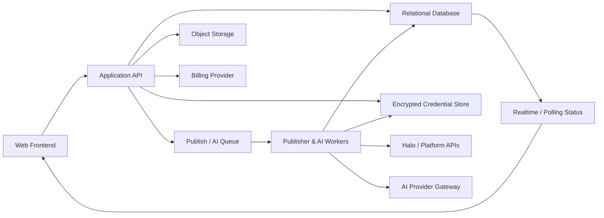

# OneFlow SaaS Architecture

更新日期：2026-06-15

## 产品定位

OneFlow 是面向 AI 内容创作者的一文多发 SaaS。核心链路是：

```text
内容库
  -> 写作与 AI 适配
  -> 渠道配置
  -> 发布前校验
  -> PublishBatch
  -> Worker 执行 PublishTask
  -> 发布记录
  -> 数据回流
  -> 用量与套餐计费
```

## 当前本地 MVP 边界

Phase 2.5 和 Phase 3S 前端当前提供：

- 浏览器本地文章编辑、版本适配、发布批次和历史快照。
- `localStorage` 数据持久化、迁移、导入与导出。
- 最小 HTML sanitizer。
- Mock 发布结果和平台能力原型。
- Hash Router、套餐权限函数与 SaaS 产品页面。

它不提供真实用户认证、租户数据库、支付、云端同步、长期凭据托管、任务队列、
服务端 AI 调用或正式平台发布。

## Phase 4 可运行后端

Phase 4 在不重写 Vanilla JS 前端的前提下加入：

- Fastify API 和统一错误响应。
- Prisma schema 与本地 SQLite 数据库。
- User、Workspace、WorkspaceMember、Article、ChannelConfig、
  ChannelVersion、PublishBatch、PublishTask、AICapability、UsageRecord 和
  Subscription。
- 本地 dev session；它不是生产认证。
- Workspace 查询隔离和服务端 Entitlement 校验。
- AES-256-GCM 凭据加密字段，API 不回传凭据。
- 进程内 Mock Publisher Worker，支持成功、失败和重试。
- 前端 `api-client.js` 与可选 `SaaS Dev Mode`。

当前实现验证了前后端分离的数据边界，但内存 Session、SQLite 和进程内 Worker
仍需在生产化阶段替换。

## 目标架构



## 公开 SaaS 必须新增的能力

- 用户、Session、第三方登录与密码重置。
- Workspace、成员、角色和租户数据隔离。
- 服务端文章、平台版本、快照、发布批次和审计记录。
- 平台 OAuth 或凭据连接服务。
- 加密凭据存储、密钥轮换和撤销。
- Durable Queue、Worker、幂等键、重试与死信队列。
- 对象存储、图片处理、CDN 与配额。
- AI Provider Gateway、Prompt 版本和调用计量。
- Subscription、Plan、Entitlement、UsageRecord 和 Billing Webhook。
- 监控、告警、日志脱敏、备份和灾难恢复。

## 前端职责

- 编辑文章、预览平台版本和发起用户确认。
- 展示套餐权限、使用量和升级入口。
- 创建发布批次请求，不直接调用第三方平台。
- 轮询或订阅 PublishTask 状态。
- 在显示前转义数据，并执行客户端 sanitizer 作为第一道防线。
- 不保存长期平台 Token，不接收已保存 Token 的明文回传。

## 后端职责

- 认证 Session、校验 WorkspaceMember 和 Role。
- 校验请求 schema、Entitlement、UsageQuota 和幂等键。
- 创建不可变 ArticleSnapshot、ChannelVersionSnapshot、PublishBatch 与 PublishTask。
- 加密保存平台凭据，返回状态而不是明文。
- 将发布、AI 和媒体任务写入队列。
- 接收 Billing Webhook 并更新 Subscription 与 Entitlement。
- 提供审计、导出、删除、数据保留与合规能力。

## 数据库职责

建议使用支持事务和行级约束的关系型数据库。所有业务表必须包含
`workspaceId`，跨表关系需要同时校验租户归属。

主要数据：

- User、Session、AuthProvider。
- Workspace、WorkspaceMember、Role。
- Article、ChannelVersion、ArticleSnapshot、ChannelVersionSnapshot。
- Channel、PlatformCredentialMetadata、PlatformCapability。
- PublishBatch、PublishTask、ValidationIssue、AuditEvent。
- Plan、Subscription、Entitlement、UsageQuota、UsageRecord、BillingCustomer。

数据库不保存平台 Token 明文。凭据字段只保存密文、密钥版本和轮换元数据。

## Worker / Queue 职责

- 消费发布、AI 适配、媒体处理和数据回流任务。
- 使用任务幂等键防止重复发布。
- 按需读取并解密平台凭据，执行完成后立即释放。
- 对 429、网络错误和平台临时故障执行受控退避重试。
- 对鉴权失败、载荷错误等不可重试错误立即失败。
- 将状态、远程 ID、URL、耗时和脱敏错误回写 PublishTask。
- 超过重试次数的任务进入死信队列并触发告警。

## 文件存储职责

- 保存用户上传封面、生成图片、平台裁剪和导出包。
- 通过 Workspace 前缀、签名 URL 和权限校验隔离资源。
- 对上传文件检查类型、尺寸、内容和恶意载荷。
- 媒体元数据进入数据库，二进制内容进入对象存储。
- CDN URL 不得绕过资源授权和删除策略。

## AI Provider 职责

AI Provider Gateway 统一处理：

- Provider 和模型选择。
- Prompt 模板版本。
- 输入大小和敏感数据策略。
- 超时、重试和降级。
- UsageRecord 与成本计量。
- 输出结构校验、内容安全和人工确认要求。

Provider API Key 只存在服务端 Secret Manager 中，不进入前端。

## Billing 职责

- BillingCustomer 与 Workspace 一一或一对多关联。
- Checkout 创建由服务端发起。
- Webhook 是 Subscription 状态的权威来源。
- Entitlement Service 根据 Plan、Subscription 和运营覆盖项生成最终权限。
- 用量采用服务端记录，前端数值只用于展示。
- 降级、欠费、取消和宽限期必须有明确状态机。

## 安全边界

- 前端不长期保存平台 Token。
- 平台 Token 必须由后端使用 envelope encryption 加密保存。
- 发布任务必须由后端 Worker 执行。
- 浏览器不能获取解密密钥或长期凭据明文。
- HTML 在前端和后端双重过滤。
- Session 使用 Secure、HttpOnly、SameSite Cookie。
- 所有查询都校验用户与 Workspace 关系。
- 日志、追踪和错误响应必须脱敏。
- 导入、导出和媒体上传必须限制大小、类型并记录审计。

## Halo 边界

提交 `c89aa06` 的 Halo 浏览器直连方案是 Phase 3 本地验证产物。Phase 3S 已用
服务端 Publisher Worker 方案取代它：

- MockPublisher 继续用于本地开发与自动测试。
- 浏览器直连 Halo 只允许作为显式开启的本地实验。
- 正式 SaaS 由后端 HaloPublisher Worker 调用 Halo API。
- Halo PAT 不暴露给浏览器。
- 正式发布链路不依赖第三方 CORS。
