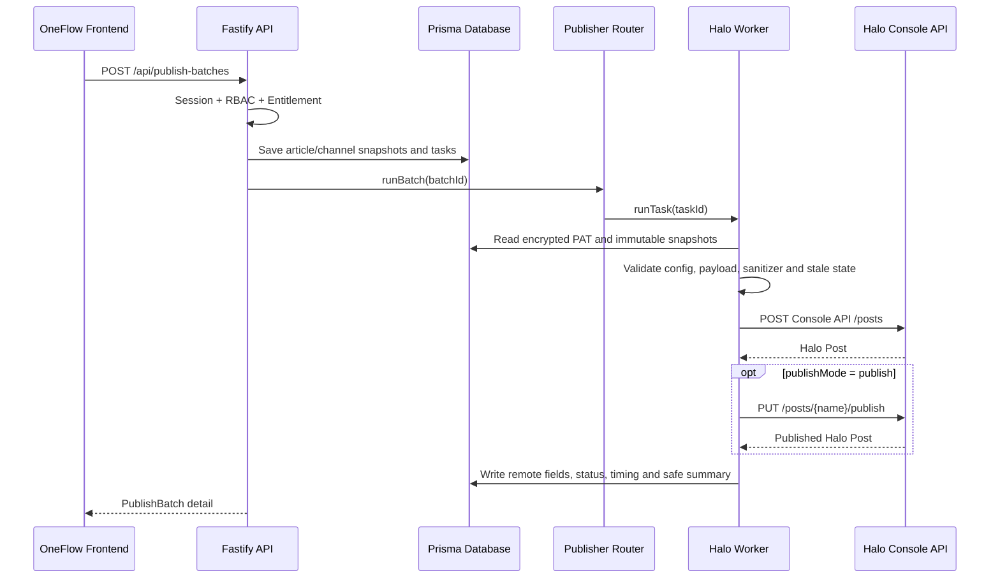

# Server-side Publisher Design

更新日期：2026-06-15

## Phase 6 已实现

当前后端包含三个明确角色：

- `MockPublisherService`：本地开发与自动测试。
- `HaloPublisherService`：Halo 2.x 请求、映射、验证和错误归一化。
- `PublisherRouterService`：根据任务平台与 `publisherMode` 选择发布器。

Halo 任务条件：

```text
task.channelConfig.platformId === "halo"
&& task.channelConfig.publisherMode === "halo"
```

其他任务继续使用 MockPublisher。

## 执行链路



## 状态

```text
pending
validating
queued
running
creating_draft
draft_created
publishing
published
failed
retrying
```

失败重试复用原始 ArticleSnapshot 和 ChannelVersionSnapshot，不读取当前编辑中的文章。

## 发布前检查

Halo Worker 在远程请求前检查：

- ChannelConfig 存在且属于当前 Workspace。
- `credentialStatus = stored` 且密文可解密。
- Base URL、Console API Endpoint 和 publishMode 有效。
- 标题、正文和 slug 有效。
- HTML 与服务端 sanitizer 输出一致。
- ChannelVersion 不是 `stale` 或 `needs_adaptation`。

失败时不创建远程草稿，任务写为 `failed`，同时创建 `ValidationIssue`。

## 安全边界

- PAT 只在后端执行请求前短时解密。
- Channel API 不返回明文或 `encryptedCredential`。
- 日志对 credential、Authorization、Cookie 和 secret 脱敏。
- `rawResponseSummary` 只保存 name、slug、phase 和 permalink。
- owner/admin 可修改凭据；editor/viewer 只能读取非敏感连接状态。

## 当前限制

Worker 仍在 API 进程内同步执行，尚无 Durable Queue、租约、幂等键、指数退避和死信
队列。生产环境应使用 PostgreSQL、独立 Worker、KMS/envelope encryption 和任务队列。
