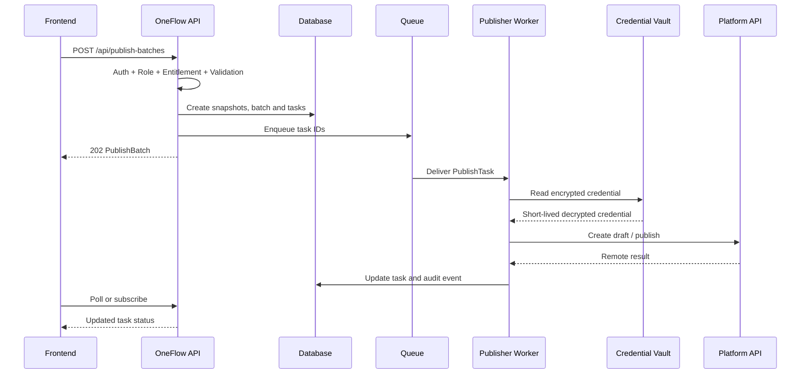

# Server-Side Publisher Design

更新日期：2026-06-14

## 核心原则

- MockPublisher 仅用于本地开发和自动测试。
- HaloPublisher 在正式 SaaS 中由后端 Worker 执行。
- 前端只创建 PublishBatch 请求和展示任务状态。
- 浏览器不持有 Halo PAT，不直接调用第三方平台 API。
- 正式发布链路不依赖第三方 CORS。

## 执行流程



## 前端职责

- 选择 ready 渠道。
- 展示发布前检查和套餐限制。
- 发送文章版本 ID、渠道 ID、策略和幂等键。
- 展示 queued、running、succeeded、failed 等状态。
- 提供重试、取消和查看远程链接入口。

前端不发送平台 Token，也不决定最终权限。

## API 服务职责

1. 验证 Session、WorkspaceMember 和 Role。
2. 验证 Plan、Entitlement 和 UsageQuota。
3. 重新检查版本是否 stale、授权状态和 ValidationIssue。
4. 事务创建 ArticleSnapshot、ChannelVersionSnapshot、PublishBatch 和
   PublishTask。
5. 为每个任务生成幂等键。
6. 写入队列并返回 `202 Accepted`。

## Worker 职责

- 根据 `publisherAdapter` 加载 Halo 或其他平台 Adapter。
- 从 Vault 获取凭据，不把凭据写回任务。
- 执行 `validateConfig`、`validatePayload` 和发布操作。
- 将远程 ID、URL、状态、耗时和脱敏错误写回。
- 对可重试错误执行指数退避。
- 对权限失败和载荷错误不自动重试。
- 更新 UsageRecord、AuditEvent 和状态事件。

## 状态模型

```text
pending
queued
validating
creating_draft
draft_created
publishing
published
failed
retrying
cancelled
```

## 幂等与重试

- PublishTask 保存 `idempotencyKey`。
- 同一键重复执行时复用已有远程结果。
- 平台不支持幂等键时，先检查已保存 remotePostId。
- 重试使用原始快照，不读取当前编辑中的文章。
- 超过最大重试次数后进入 dead letter，并提示人工处理。

## Halo Adapter

Halo Worker 可以使用已确认的 Halo 2.x Console API：

- 创建草稿：`POST /apis/api.console.halo.run/v1alpha1/posts`
- 发布草稿：`PUT /apis/api.console.halo.run/v1alpha1/posts/{name}/publish`

具体 Endpoint 作为服务端 Channel 配置，不由浏览器拼接。PAT 在 Vault 中加密保存。

## 状态回传

第一阶段可轮询：

```text
GET /api/publish-batches/:id
```

后续可使用 SSE 或 WebSocket 推送：

```json
{
  "type": "publish_task.updated",
  "workspaceId": "ws_01",
  "batchId": "pb_01",
  "taskId": "pt_01",
  "status": "draft_created",
  "occurredAt": "2026-06-14T12:00:00Z"
}
```

## 本地模式

MockPublisher 可以在浏览器或 Node 测试中模拟成功、失败和重试。它不能被当作真实
平台能力证明。浏览器直连 Halo 只保留为本地实验，不属于正式 SaaS 架构。
